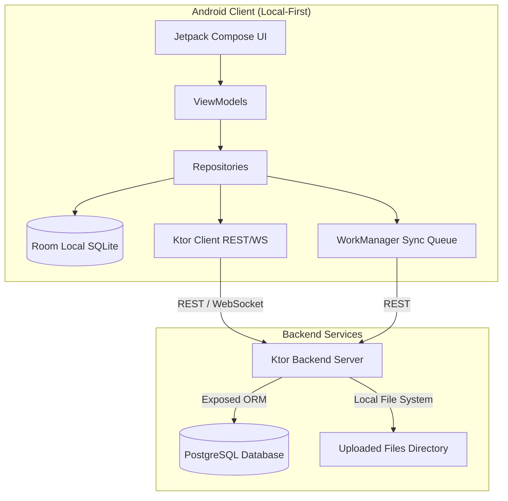

# CollabSphere

CollabSphere is a premium, local-first team collaboration platform consisting of a **Jetpack Compose Android Client** and a **Ktor Backend Server** backed by **PostgreSQL**. It supports real-time communication, workspace management, task tracking, notes, and file sharing with seamless offline support.

---

## 🏗️ Project Architecture



---

## ✨ Features

### 1. 🔐 User Authentication & Local Resilience
* **Precedence-based Login**: Authenticates online first, caching credentials securely. Falls back to local cache if offline, ensuring uninterrupted login and access to offline data.
* **Profile Management**: Instant profile updates with real-time UI propagation across Jetpack Compose screens.

### 2. 🏢 Advanced Workspace Management
* **Custom Workspaces**: Create private workspaces, manage permissions, and invite teammates seamlessly.
* **Cascading Offline Swaps**: Generates offline-safe temporary IDs when creating resources offline. Automatically resolves and swaps temporary IDs to server-generated IDs once connectivity is restored, seamlessly propagating updates across all associated channels, messages, files, and tasks.

### 3. 💬 Real-Time Messaging (Channels & DMs)
* **Real-time WebSockets**: Lightning-fast, WebSockets-driven direct messaging and channel communication with active background connection monitoring.
* **Dedicated Channels**: Workspace-specific communication channels featuring offline message queuing.
* **Cache Integrity**: Smart random negative ID generation for unsent offline messages avoids collisions. Auto-matches content & timestamp on server acknowledgment to resolve local records without duplication.

### 4. 📋 Task Tracking & Delegation
* **Workspace Tracker**: Create, manage, and delegate tasks to team members within specific workspaces.
* **Progress Statuses**: Track task flow via `To Do`, `In Progress`, and `Done` states with automatic background synchronization powered by Android WorkManager.

### 5. 📝 Collaborative Workspace Notes
* **Local Notes Cache**: Document ideas and meeting notes reliably in an offline-first format.
* **Background Synchronization**: Synchronizes automatically once internet connectivity is restored, ensuring zero data loss and seamless team collaboration.

### 6. 📁 File Sharing & Attachment Management
* **Multipart File Transfer**: Upload, share, and download document attachments directly from the server.
* **Offline Upload Queue**: Smartly queues upload operations and gracefully resolves local-to-remote file IDs for uninterrupted file management in low-connectivity environments.

### 7. 🎨 Premium Tactile Skeuomorphism UI
* **High-Fidelity Interface**: Features a precision-engineered UI built on modern skeuomorphic principles with tactile, volumetric elevation planes.
* **Sensory Feedback**: Implements dynamic directional lighting, debossed interaction states, and polished micro-bevels to deliver an immersive and grounded premium user experience.

---

## 🛠️ Tech Stack

### Android Client
* **UI**: Jetpack Compose, Material 3
* **Local Database**: Room DB (SQLite)
* **DI**: Koin
* **HTTP & Sockets**: Ktor Client, OkHttp
* **Background Worker**: Android Jetpack WorkManager
* **Preferences**: DataStore Preferences

### Backend Server
* **Engine**: Ktor (Netty)
* **Database Access**: Kotlin Exposed ORM, HikariCP
* **Database**: PostgreSQL
* **Serialization**: kotlinx.serialization (JSON)
* **Real-time**: Ktor WebSockets

---

## 🚀 Running Locally

### 1. Database Setup
Ensure you have a PostgreSQL instance running locally. Create a database named `Collabsphere`:
```sql
CREATE DATABASE "Collabsphere";
```

### 2. Run Ktor Server
Configure connection details in `DatabaseFactory.kt` and run:
```bash
cd collabpshere_server
./gradlew run
```

### 3. Run Android Client
Open `Rohit_Project_Challlange` in Android Studio and run the app on an emulator or physical device. Ensure your device is on the same local network subnet as your laptop.
