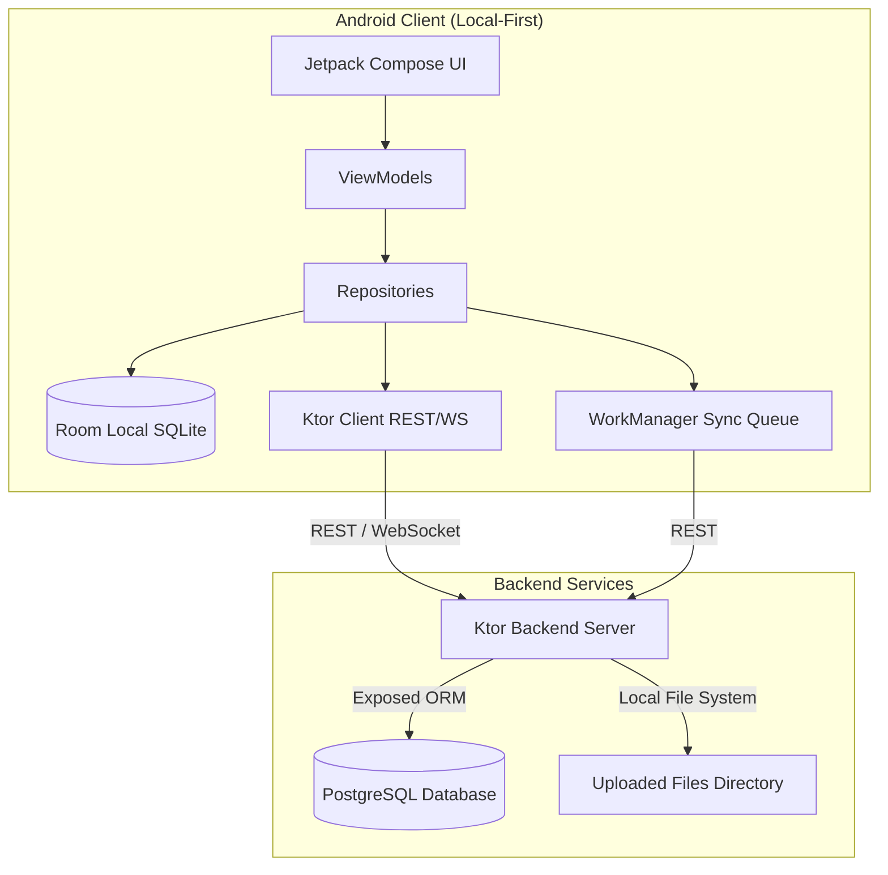

# CollabSphere

CollabSphere is a premium, local-first team collaboration platform consisting of a **Jetpack Compose Android Client** and a **Ktor Backend Server** backed by **PostgreSQL**. It supports real-time communication, workspace management, task tracking, notes, and file sharing with seamless offline support.

---

## 🏗️ Project Architecture


```mermaid
graph TD
    subgraph "Android Client (Local-First)"
        UI[Jetpack Compose UI] --> VM[ViewModels]
        VM --> Repo[Repositories]
        Repo --> Room[(Room Local SQLite)]
        Repo --> WorkMgr[WorkManager Sync Queue]
        Repo --> KtorClient[Ktor Client REST/WS]
    end

    subgraph "Backend Services"
        KtorClient -->|REST / WebSocket| KtorServer[Ktor Backend Server]
        WorkMgr -->|REST| KtorServer
        KtorServer -->|Exposed ORM| PostgreSQL[(PostgreSQL Database)]
        KtorServer -->|Local File System| Disk[Uploaded Files Directory]
    end
```

---

## ✨ Features

### 1. 🔐 User Authentication & Local Resilience

CollabSphere implements a **precedence-based authentication system** that prioritizes online login while maintaining a robust offline fallback. When a user submits their credentials, the `UserRepo` first attempts to authenticate against the Ktor backend via REST. Upon a successful online login, the server returns a JWT token along with the user profile, and the client immediately persists both the token (via `DataStore Preferences`) and the user record (via Room's `UserDao`) to the local SQLite database. The password is stored as a **bcrypt hash** locally — not the raw password — ensuring that cached credentials are never exposed in plaintext even if the device is compromised.

When the device is offline, the system gracefully degrades to the local Room cache. The `loginRemote` function catches any network exception and checks whether a matching `UserEntity` already exists in Room. If it does, it validates the entered password against the stored bcrypt hash using `PasswordHasher.matches()`. This means a user who has logged in at least once online can continue to access the app with full functionality even without an internet connection. The system also handles edge cases such as unverified email addresses — if the cached user has `isEmailVerified = false`, the offline login is rejected with a clear `EMAIL_NOT_VERIFIED` error, maintaining security parity with the server.

The authentication layer also includes **OTP-based email verification** during registration. New users receive a 6-digit verification code sent via the server's `EmailService` (which supports Gmail OAuth2 API, SMTP, and a console fallback for development). Users must verify their email before their first login is permitted. Additionally, CollabSphere supports a **Forgot Password** flow where users receive a password reset OTP, enter it in-app, and set a new password — all without leaving the application.

**Profile management** is equally robust. Users can update their username, bio, and status message through the `updateProfile` API. The client performs an optimistic local update to Room first, then pushes changes to the server. If the server call fails (e.g., offline), the local state still reflects the update immediately, and the change is reconciled on the next sync. Profile updates propagate in real time across all Jetpack Compose screens through Room's reactive `Flow`-based queries, so every UI surface that displays the user's name or avatar refreshes automatically. Users can also upload a **custom avatar** via Cloudinary integration or have one auto-generated by the server's `AvatarGenerator` service.

### 2. 🏢 Advanced Workspace Management

Workspaces in CollabSphere serve as the foundational organizational unit, analogous to a team or project space. Each workspace has an owner, a name, and a password-protected configuration. Users can **create new workspaces**, which are immediately reflected in the UI through Room's reactive `Flow<List<WorkspaceEntity>>`. The `WorkspaceRepo` first attempts to push the creation to the Ktor backend via `WorkspaceApiService.createWorkspace()`. If the server responds successfully, the workspace is saved locally with the server-generated ID. If the network call fails, the system assigns a **negative temporary ID** from `TempId.next()` (which draws from a thread-safe `AtomicInteger` in the negative range) and stores the workspace locally. A `WorkspaceSyncWorker` is then enqueued via Android WorkManager with a `NetworkType.CONNECTED` constraint and exponential backoff, ensuring the creation is retried automatically when connectivity returns.

The **cascading ID swap** mechanism is one of CollabSphere's most technically sophisticated features. When a workspace is created offline with a temporary negative ID, every downstream entity — channels, messages, tasks, notes, files, and workspace members — references that temporary ID as a foreign key. When the `WorkspaceSyncWorker` finally succeeds and receives the real server-generated ID, it must cascade the ID change through the entire local database. This ensures that all associated data seamlessly transitions from referencing the temporary ID to the permanent one, without any orphaned records or broken foreign key constraints. Room's deferred foreign keys (`deferred = true` on all `ForeignKey` declarations) enable this atomic swap to happen within a single database transaction.

**Member management** allows workspace owners to invite teammates by email. The `addMemberToWorkspaceByEmail` function sends an `AddMemberRequest` to the server, which resolves the email to a user ID, inserts a `WorkspaceMembersTable` row with a `MEMBER` role (or `OWNER` for the creator), and returns the member profile. The client then upserts the member's `UserEntity` and `WorkspaceMemberEntity` into Room. If the invite fails due to a network error, the system checks whether the user exists locally by email, creates a local membership record optimistically, and enqueues a background sync. The server also supports a **role-based permission model** with `OWNER` and `MEMBER` roles stored in `WorkspaceMembersTable.role`, controlling who can manage workspace settings and delete the workspace.

CollabSphere also supports **workspace invitations via email**. When an owner invites a user who isn't yet registered, the server generates a unique invite code (stored in `WorkspaceInvitationsTable` with `PENDING`, `ACCEPTED`, or `DECLINED` status and an expiration timestamp) and sends a beautifully branded HTML email via the `EmailService`. The invited user can then open CollabSphere, tap "Join with Code" on their Dashboard, and enter the invite code to accept the invitation and join the workspace instantly.

### 3. 💬 Real-Time Messaging (Channels & DMs)

Real-time communication in CollabSphere is powered by **Ktor WebSockets** on both the client and server. The server maintains a `ConcurrentHashMap<Long, MutableSet<WebSocketServerSession>>` called `activeDmSessions`, which maps each user ID to a set of active WebSocket sessions. This multi-session design means a single user can have multiple simultaneous connections (e.g., from different devices), and messages are fan-out broadcast to all of them via the `sendToUser()` helper. The server also tracks `channelCapableSessions` separately, allowing channel message events to be broadcast only to sessions that have opted into channel updates, reducing unnecessary network traffic.

On the **Android client**, the `DmRepo` manages the full lifecycle of direct messages. When a user sends a DM, the system creates a `DmEntity` with a temporary negative ID (via `TempId.next()`), immediately inserts it into Room for instant local display, and then attempts to send it over the active WebSocket connection as a JSON `DmDto` with `action = "SEND_MESSAGE"`. If the WebSocket send fails (e.g., the connection dropped), the message is automatically enqueued as a `DmSyncWorker` background task via WorkManager with a `CONNECTED` network constraint and exponential backoff starting at 10 seconds. The user sees their message in the chat immediately — marked as pending — and it is retried transparently in the background.

The **cache deduplication** strategy is carefully engineered to prevent ghost messages. When the server acknowledges a sent message with a `MESSAGE_DELIVERED` action containing the real server-assigned ID, the client calls `dmDao.deleteDmByContentAndTimestamp(content, timestamp)` to remove the temporary local row, then inserts a fresh `DmEntity` with the real ID. This content-and-timestamp matching approach handles the race condition where the server acknowledgment arrives before the temporary insert's transaction commits. The system also handles `UPDATE_MESSAGE`, `DELETE_MESSAGE`, `READ_RECEIPT`, `TYPING_START/STOP`, `USER_ONLINE/OFFLINE`, and `REACT_MESSAGE/UNREACT_MESSAGE` WebSocket events, each with its own local-state update path. Message reactions are stored in `DmReactionsTable` with a composite primary key of `(messageId, userId, emoji)`.

**Dedicated workspace channels** provide team-wide communication within a workspace. Each channel has a name, description, and is scoped to a specific workspace via `ChannelsTable.workspaceId`. Channel messages support all the same features as DMs — reply threads (via `replyToId`), media attachments (via `mediaUrl` backed by Cloudinary), message pinning (via `pinnedAt` and `pinnedByUserId`), emoji reactions (stored in `ChannelReactionsTable`), and read state tracking (via `ChannelReadStateTable` which records the `lastReadMessageId` per user per channel). When a channel message is created or updated, the server's `broadcastChannelMessageChange()` function serializes the message snapshot and broadcasts it to all workspace members who have an active channel-capable WebSocket session, enabling real-time live updates.

The DM system also supports **media sharing** through `sendMediaDm()`, which uploads files to the server (backed by Cloudinary) and sends a DM with the resulting media URL. **Typing indicators** are transmitted as ephemeral WebSocket events (`TYPING_START`/`TYPING_STOP`) that are handled in-memory only and never persisted to the database. **Online presence** is tracked through `USER_ONLINE`/`USER_OFFLINE` events, and users can query the currently online members of a workspace via a dedicated REST endpoint.

### 4. 📋 Task Tracking & Delegation

CollabSphere's task management system is a full-featured project tracker integrated directly into each workspace. Tasks are modeled by `TaskEntity` with rich attributes: `taskName`, `taskDescription`, `status` (an enum of `TO_DO`, `IN_PROGRESS`, `DONE`), `priority` (an enum of `LOW`, `MEDIUM`, `HIGH`), `dueDate` (as a Unix timestamp), a `checklist` (a JSON-serialized list of `ChecklistItem` objects for sub-task tracking), and `labels` (a JSON-serialized list of strings for categorization). Tasks are scoped to a workspace via `workspaceId` and support both a `createdByUserId` and an optional `assignedToUserId`, with proper Room foreign key constraints and indices for efficient querying.

Creating a task follows the same **offline-first pattern** as workspaces. The `TaskRepo.addTask()` function first generates a UUID-based **idempotency key**, then attempts to create the task on the server via `TaskApiService.createTask()`. If successful, the server-returned ID is used for the local Room insert. If the network call fails, a temporary negative ID is generated, the task is saved locally, and a `TaskSyncWorker` is enqueued with the idempotency key frozen into its `workDataOf` input. The idempotency key is stored server-side in `TasksTable.idempotencyKey` with a unique index, so if a WorkManager retry succeeds after a previously successful-but-lost response, the server returns the existing row instead of creating a duplicate — a critical safeguard against the at-least-once delivery semantics of WorkManager.

**Task updates** and **deletions** follow a similar optimistic pattern. `updateTask()` writes the change to Room immediately, then pushes it to the server. If the server call fails, a sync worker is enqueued. The function returns a `TaskSyncOutcome` enum — either `CONFIRMED` (server acknowledged) or `QUEUED` (deferred to background) — so the UI can optionally display a sync indicator. Deleting a task removes it from Room immediately for instant UI feedback, then enqueues a background delete sync if the server call fails. The `getTasks()` function returns a reactive `Flow<List<TaskEntity>>` from Room, so the Compose UI automatically recomposes whenever tasks are added, updated, or deleted.

The **delta sync loop** in `TaskRepo.startDeltaSyncLoop()` keeps tasks in sync across devices and team members. It runs as a coroutine scoped to the ViewModel's lifecycle, polling the server every second for any tasks updated since the last sync timestamp (stored per-workspace in DataStore Preferences). The loop respects the app's foreground state — it suspends entirely while the app is backgrounded using `MyApplication.isAppForegroundFlow.first { it }`, eliminating wasteful network requests when the user isn't actively looking at the screen. A `ConcurrentHashMap.newKeySet<Int>()` guard prevents duplicate sync loops from starting if the user navigates to the same workspace's task screen multiple times. The sync also proactively refreshes workspace member data via `syncWorkspaceMembers()` to ensure the assignee picker always has up-to-date member names and avatars.

The server additionally runs an automated **Task Reminder Scheduler** (`TaskReminders.kt`). A background coroutine checks every 15 minutes for tasks whose `dueDate` falls within a 24-hour window and whose `reminderSentAt` is still null. For each qualifying task, it atomically claims the reminder (preventing duplicate sends in a multi-instance deployment) and pushes an in-app notification to the assigned user with a contextual message like *"Your task is due tomorrow"* or *"Your task is due today"*. This server-side scheduler complements the client-side sync by ensuring users are proactively notified even if they haven't opened the app recently.

### 5. 📝 Collaborative Workspace Notes

The notes system in CollabSphere provides a lightweight, offline-first document space for capturing ideas, meeting notes, and reference material within each workspace. Each note is modeled by `NotesEntity` with fields for `notesName`, `description` (full text content), `userId`, `workspaceId`, and an `isPinned` boolean for prioritizing important notes. The Room DAO returns a reactive `Flow<List<NotesEntity>>` so the Compose UI updates instantly as notes are created, edited, pinned, or deleted.

Creating a note follows the same battle-tested offline pattern. `NotesRepo.addnotestoscreen()` generates a UUID **idempotency key** upfront, attempts to create the note on the server, and either saves the server-confirmed note locally or falls back to a temporary negative ID with a background `NotesSyncWorker`. The idempotency key is stored in `NotesTable.idempotency_key` with a unique index on the server, preventing duplicate note creation on retried WorkManager jobs. Each sync worker is enqueued with a **per-note unique work name** (`NOTES_SYNC_$noteId`) using `ExistingWorkPolicy.APPEND_OR_REPLACE`, which ensures that one permanently-failed sync cannot block every other note's sync queue — a lesson learned from earlier iterations where a shared work name caused cascade failures.

**Editing and deleting notes** are equally resilient. `updatetheNote()` writes the update to Room first (optimistic UI), then pushes to the server. If offline, it enqueues a sync worker. `deletenotestoscreen()` calls the server delete API and removes the local record; if offline, it defers the server-side delete to a background sync while still removing the note from the local UI immediately. Users can also **pin important notes** via `setPinned()`, which toggles the `isPinned` flag both on the server and locally. The delta sync loop runs every 5 seconds while the app is foregrounded, fetching any notes updated since the last sync timestamp and applying upserts and deletes as a single Room transaction via `notesDao.applyDelta(upserts, deletes)`.

The delta sync engine for notes mirrors the workspace and task sync architectures. It stores the last sync timestamp per-workspace in DataStore Preferences, uses the `isAppForegroundFlow` suspension to avoid background polling, and employs a `ConcurrentHashMap.newKeySet()` guard to prevent duplicate loops. The server response includes an `isDeleted` flag for each note, allowing the client to detect remote deletions and remove the corresponding local records — enabling true multi-device, multi-user collaboration where one team member's edits are reflected across everyone's devices within seconds.

### 6. 📁 File Sharing & Attachment Management

CollabSphere's file system enables workspace members to **upload, download, and manage document attachments** directly within a workspace. The `FileEntity` model tracks rich metadata: `fileName`, `mimeType`, `sizebytes`, `url` (the server-accessible download URL), `fileLocation` (the server-side storage path), `localpath` (the device-local path for offline access), `userId`, `userName`, and `workspaceId`. Files support the full spectrum of document types — PDFs, images, spreadsheets, presentations, and more — with a server-enforced **25 MB upload limit** (`MAX_UPLOAD_BYTES`).

Uploading a file goes through `FileRepo.uploadfilestoscreen()`, which first validates that the local file path exists and is accessible. It then calls `fileApiService.uploadFile()` with multipart form data, sending the physical file along with metadata (userId, workspaceId, userName). On success, the server returns the file's ID, URL, and storage location, and the client saves the complete `FileEntity` to Room. If the upload fails due to a network error, the system assigns a **negative temporary ID** from `TempId.nextLong()` (using the long variant since file IDs are `Long`), inserts a placeholder `FileEntity` into Room, and enqueues a `FileSyncWorker` with all the file metadata and the local path. The WorkManager constraint ensures the upload is retried only when network connectivity is restored, with exponential backoff starting at 10 seconds.

**Downloading files** is handled by `downloadFileFromServer()`, which streams the file content from the server URL to a local `File` destination. The `deletefiles()` function attempts a server-side delete first; if the server explicitly rejects the deletion (as opposed to a network error), the rejection is still deferred to a background sync rather than silently dropping the intent. The local Room record is deleted immediately in both success and failure paths, providing instant UI feedback while the actual server-side deletion is guaranteed eventually. The delta sync loop for files runs every 5 seconds, fetching any files updated since the last sync timestamp and applying upserts/deletes via `fileDoa.applyDelta()`.

Each file sync worker uses a **per-file unique work name** (`FILE_SYNC_$fileId`) to isolate sync failures. This architectural choice prevents a single corrupted or oversized file from blocking the entire file sync queue — if one file's upload permanently fails, other files continue to sync independently. The exponential backoff with `APPEND_OR_REPLACE` policy ensures that rapid user actions (e.g., deleting a file immediately after uploading it) are coalesced into a single coherent sync operation rather than racing against each other.

### 7. 🔗 GitHub Integration & DevOps Analytics

CollabSphere integrates directly with **GitHub** to bridge team communication and development workflows. The integration is powered by a comprehensive suite of server-side services: `GitHubAuthService` handles OAuth authentication and token management (with encrypted refresh and access tokens stored in `GitHubConnectionsTable`), `GitHubService` manages repository data synchronization, `GitHubWebhookService` processes incoming webhook events, and `GitHubBot` automates channel notifications.

Once a user connects their GitHub account, they can **link repositories to workspaces** via `GitHubRepositoriesTable`. The server periodically syncs repository data including **commits** (`GitHubCommitsTable` — SHA, message, author, date), **pull requests** (`GitHubPullRequestsTable` — state, author, merge status, head SHA), **issues** (`GitHubIssuesTable` — number, title, state, author), **contributors** (`GitHubContributorsTable` — username, commit count), and **CI/CD check suites** (`GitHubCheckSuitesTable` — status, conclusion, head SHA). All data is stored with unique indices to support idempotent upserts during sync.

The Android client's `GitHubViewModel` provides a rich **analytics dashboard** exposing total commits, open/merged pull requests, open issues, top contributors, commit activity trends, recent commits with details, and recent pull requests. Workspace owners can configure a **notify channel** for each linked repository — when GitHub webhook events arrive (pushes, PR opens/merges, issue updates, check suite completions), the `GitHubBot` posts formatted notification messages directly into the designated workspace channel, keeping the entire team informed without leaving CollabSphere.

The integration also supports **task-to-GitHub linking** through `GitHubTaskLinksTable`, which associates CollabSphere tasks with GitHub issues, pull requests, or branches via a `(taskId, kind, ref)` composite key. This enables bidirectional traceability — team members can see which GitHub PR implements a specific CollabSphere task, and vice versa.

### 8. 🔔 Push Notifications & In-App Notification Center

CollabSphere features a comprehensive **multi-channel notification system** spanning push notifications, in-app alerts, and a persistent notification center. On the server, `FcmService` initializes the **Firebase Admin SDK** using credentials resolved from environment variables (raw JSON, file path, well-known local files, or Application Default Credentials), supporting seamless deployment across local development, Render, and GCP environments. When a notification-worthy event occurs — a new DM, channel message, @mention, task assignment, task update, or workspace invitation — the server's `createAndPushNotification()` function inserts a record into `NotificationsTable` (with fields for `recipientId`, `actorId`, `type`, `title`, `body`, `workspaceId`, `referenceId`, and `isRead` status) and pushes an FCM message to the recipient's registered device token.

On the Android client, `NotificationHelper` manages a sophisticated **conversation-style notification** system with per-partner conversation histories, avatar generation (using a custom `Canvas`-based letter avatar renderer), inline reply actions via `RemoteInput`, and notification grouping. The helper maintains a `ConcurrentHashMap<Int, MutableList<...>>` of in-memory conversation histories keyed by partner ID, enabling rich multi-message notification stacking. It also respects a **Quiet Hours** system (via `QuietHoursStore`) that suppresses notification sounds and vibrations during user-configured time windows.

The **in-app Notification Center** (`NotificationsViewModel`) provides a paginated feed of all notifications, with the ability to mark individual notifications or entire batches as read. Real-time notification delivery is handled via a dedicated WebSocket push frame (`NotificationPushFrame`), so new notifications appear instantly in the app without polling. Notification muting is granular — users can mute notifications per-workspace or per-channel via `NotificationMutesTable`, and the server respects these preferences before dispatching FCM pushes.

### 9. ✉️ Email Verification & Workspace Invitations

CollabSphere's `EmailService` implements a **3-tier email dispatch system** with automatic failover. **Tier 1** uses the Gmail REST API via OAuth2 over HTTPS (Port 443), which avoids firewall issues with SMTP ports on cloud platforms like Render. The service maintains a cached OAuth2 access token with automatic refresh when it expires, using Google's token endpoint to exchange a refresh token for a new access token. **Tier 2** falls back to standard SMTP (Port 587/465 with STARTTLS) if Gmail API is unavailable. **Tier 3** logs the email content to the console for development environments where no email provider is configured.

All emails are sent as **beautifully branded HTML** with CollabSphere's visual identity — warm surface colors (`#FDFBF7` backgrounds), the signature coral accent (`#F0633D`), and clean typography. Three email templates are implemented: **verification OTPs** (6-digit code with 15-minute expiry for new account activation), **password reset OTPs** (6-digit code with 15-minute expiry for the forgot-password flow), and **workspace invitations** (containing the inviter's name, workspace name, and a unique invite code with an expiration timestamp). Each email includes priority headers (`X-Priority: 1`, `Importance: high`) to maximize inbox visibility.

The **workspace invitation system** supports a full lifecycle: an owner sends an invite by email, the server generates a short alphanumeric invite code (stored in `WorkspaceInvitationsTable` with `PENDING` status and a configurable expiry), the recipient receives a branded email with the code, opens CollabSphere, enters the code via "Join with Code" on the Dashboard, and the server validates the code, updates the invitation status to `ACCEPTED`, and adds the user as a workspace member. Declined or expired invitations are handled gracefully, and the system prevents duplicate invitations to the same email for the same workspace.

### 10. 💬 Message Reactions, Read Receipts & Typing Indicators

CollabSphere supports **emoji reactions** on both DMs and channel messages. On the DM side, reactions are sent as WebSocket events with `action = "REACT_MESSAGE"` or `"UNREACT_MESSAGE"`, and are stored locally in `DmReactionsTable` with a composite primary key of `(messageId, userId, emoji)`. This schema allows multiple users to react with the same emoji and each user to use multiple different emojis on a single message. The `DmRepo` exposes `getReactionCountsForMessage()` and `getUserReactionsForMessage()` for the UI to display aggregated emoji counts and highlight which reactions the current user has added. Channel reactions work identically via `ChannelReactionsTable`, and the server broadcasts reaction updates to all workspace members via the channel-capable WebSocket fan-out.

**Read receipts** provide message delivery confirmation in DMs. When a user opens a conversation, the client sends a `MARK_READ` WebSocket event. The server records the read state and broadcasts a `READ_RECEIPT` event back to the sender, who then updates all their sent messages to that receiver as read via `dmDao.markAllReadFrom()`. This is an optimistic local update — the UI immediately shows the read status even before the server confirms, creating a responsive feel.

**Typing indicators** are ephemeral, real-time signals transmitted via WebSocket. When a user starts typing, a `TYPING_START` event is sent; when they stop (after a debounce), a `TYPING_STOP` event follows. These events are handled purely in-memory — they are never persisted to the database — and the `saveIncomingDm()` function explicitly filters them out before any Room write. The result is a lightweight, low-latency presence signal that informs chat participants without incurring storage or sync overhead.

### 11. 🚫 User Blocking & Privacy Controls

CollabSphere includes a **user blocking system** backed by `UserBlocksTable`, which stores `(blockerId, blockedId)` pairs. Blocked users are prevented from sending DMs and their messages can be filtered from the UI. The `BlockedUsersViewModel` provides the Compose UI with a list of currently blocked users and actions to block/unblock.

**Privacy settings** are granular and user-controlled. The `UsersTable` includes `showEmail`, `showOnlineStatus`, `showLastSeen`, and `profileVisibility` (either `"public"` or `"members_only"`) columns. Users can toggle these settings via the `PrivacySettingsRequest` API, controlling what information other users can see on their public profile. The `PublicProfileViewModel` respects these settings when rendering another user's profile, hiding email addresses, online status, or last-seen timestamps according to the viewed user's preferences.

### 12. 🔄 Delta Sync Engine & Offline-First Architecture

The cornerstone of CollabSphere's reliability is its **delta sync engine** — a unified architectural pattern applied consistently across workspaces, channels, messages, tasks, notes, and files. Each repository implements a `startDeltaSyncLoop()` coroutine that runs in the ViewModel's scope and follows the same lifecycle: (1) suspend while the app is backgrounded using `MyApplication.isAppForegroundFlow.first { it }`, (2) read the last sync timestamp from DataStore Preferences, (3) fetch only records updated since that timestamp from the server, (4) apply upserts and deletes to Room via a single transactional DAO call, (5) update the sync timestamp, (6) delay for the configured polling interval, and (7) repeat.

This architecture means CollabSphere **never performs full data refetches** after the initial sync. Every subsequent sync only transfers the incremental changes, dramatically reducing bandwidth and battery consumption. The server supports this by maintaining `updatedAt` timestamps and `isDeleted` soft-delete flags on every table, allowing the delta endpoint to return a compact changeset. The polling intervals are tuned per-feature: tasks sync every 1 second for near-real-time responsiveness, notes and files sync every 5 seconds, and workspaces sync every 30 seconds.

Each sync loop is protected by a `ConcurrentHashMap.newKeySet<Int>()` **concurrency guard** that prevents duplicate loops from running simultaneously. Since repositories are Koin singletons shared across multiple ViewModel instances, navigating between screens without properly popping the backstack could otherwise start multiple independent pollers against the same server endpoint. The guard uses an atomic `add()` check — if the user/workspace ID is already in the active set, the new loop returns immediately. The `finally` block ensures the ID is removed when the loop is cancelled, preventing permanent lockout.

The **WorkManager sync queue** provides the durable offline mutation pipeline. Every create, update, or delete operation that fails due to a network error is serialized into a `workDataOf(...)` bundle and enqueued as a `OneTimeWorkRequest` with a `NetworkType.CONNECTED` constraint and `BackoffPolicy.EXPONENTIAL` starting at 10 seconds. Each entity type has its own dedicated `SyncWorker` class (`WorkspaceSyncWorker`, `TaskSyncWorker`, `NotesSyncWorker`, `FileSyncWorker`, `DmSyncWorker`), and work names are **scoped per-entity-instance** (e.g., `TASK_SYNC_$taskId`) rather than per-entity-type, isolating failures so one stuck sync cannot block others.

### 13. 🎨 Premium Tactile Skeuomorphism UI

CollabSphere's user interface is built on a bespoke **Modern Tactile Skeuomorphism** design system that eschews both generic flat design and heavy-handed retro skeuomorphism. Instead, it implements precision-engineered physical cues — directional lighting at a fixed 135° angle (top-left to bottom-right), soft cast shadows, specular highlights, debossed input troughs, and raised interactive plates — to create an interface that feels physically milled out of solid composite matter.

The **color palette** is built on a warm, organic foundation: a base canvas of `#EFEDE7` provides a gallery-warm substrate, with raised surfaces at `#F6F4EF` and floating modals at `#F9F7F2`. Primary interactions use a coral gradient (`#F0633D` → `#D6501F`), collaboration presence uses secondary indigo (`#4C55C4`), and semantic states are communicated through success mint (`#4E9E78`), warning amber (`#E0A030`), and destructive red (`#D64545`). Every color choice is optimized for the directional lighting model, with specular highlights at `rgba(255, 255, 255, 0.85)` and occlusion shadows at `rgba(160, 150, 138, 0.55)`.

**Typography** pairs Newsreader (a warm variable serif) for headlines and editorial elements with Manrope (a geometric sans-serif, weights 400–800) for UI elements. Display sizes use tight negative letter-spacing (`-0.02em`) to maintain cohesion against ambient shadows, while compact labels and badge text use wide tracking (`+0.04em`) to preserve readability under etched lighting. The **elevation system** defines five distinct planes — debossed/inset (stamped into the canvas with inner shadows), ground plane (flat canvas), raised (dual-shadow cards and buttons), floating (disconnected modals with deep diffused shadows), and pressed/active (instant transition from raised to debossed with a `0.98` scale transform). The spacing system is built on a 4px sub-grid grouped into 8px structural steps, with responsive breakpoints at mobile (<768px), tablet (768–1199px), and desktop (1200px+).

---

## 🛠️ Tech Stack

### Android Client
* **UI**: Jetpack Compose, Material 3
* **Local Database**: Room DB (SQLite)
* **DI**: Koin
* **HTTP & Sockets**: Ktor Client, OkHttp
* **Background Worker**: Android Jetpack WorkManager
* **Preferences**: DataStore Preferences

### Backend Server
* **Engine**: Ktor (Netty)
* **Database Access**: Kotlin Exposed ORM, HikariCP
* **Database**: PostgreSQL
* **Serialization**: kotlinx.serialization (JSON)
* **Real-time**: Ktor WebSockets

---

## 🚀 Running Locally

### 1. Database Setup
Ensure you have a PostgreSQL instance running locally. Create a database named `Collabsphere`:
```sql
CREATE DATABASE "Collabsphere";
```

### 2. Run Ktor Server
Configure connection details in `DatabaseFactory.kt` and run:
```bash
cd collabpshere_server
./gradlew run
```

### 3. Run Android Client
Open `Rohit_Project_Challlange` in Android Studio and run the app on an emulator or physical device. Ensure your device is on the same local network subnet as your laptop.
